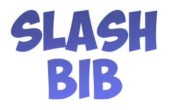

<div align="center">
    
    <p>A multi-functional discord bot in D#+.</p>
</div>

# SlashBib

This is my multipurpose discord bot made in CSharp with D#+, There is also another version of SudoSlash on gitlab but it is not maintained anymore because the project was not so serious.

## Getting started

- First you need to go on [Discord Developer Portal](https://discord.com/developers/applications) get some discord token.

- Second, all the configuration, languages and more are stored in the [config.json](src/SlashBib/config.json) file, token are stored in a hidden file named **.secret.json**

*.secret.json*

```json
{
  "TOKEN": "..."
}
```

## Planned

- [ ] External module load
- [ ] Language by guild
- [ ] Image manipulation
- [ ] Games API
- [ ] ...
